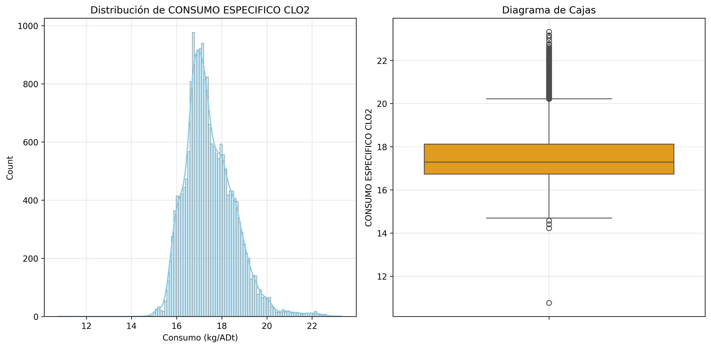
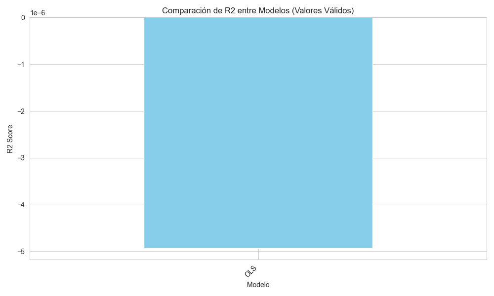

```{r setup, include=FALSE}
# Configuración
knitr::opts_chunk$set(echo = FALSE, warning = FALSE, message = FALSE)
library(tidyverse)
library(knitr)
library(kableExtra)
```

## 1. COMPRENSIÓN DEL PROBLEMA

### 1.1 Contexto Industrial

Objetivo: Modelar el consumo específico de ClO₂ para reducir costos en el blanqueo de pulpa.

Datos: Registros históricos (Enero-Agosto 2019) con 98 variables predictoras.

```{r}
metadatos <- jsonlite::fromJSON("metadatos.json")
data.frame(
  "Métrica" = c("Consumo Actual", "Objetivo Diseño", "Desviación", "Ahorro Potencial (30%)"),
  "Valor" = c("19.10 kg/ADt", "17.5 kg/ADt", "+9.14%", "USD 500,000/año")
) %>% kable(align = 'c', caption = "Indicadores Clave") %>% kable_styling()
```

## 2. COMPRENSIÓN DE LOS DATOS

### 2.1 Análisis Exploratorio

Distribución del Target:

```{r}

```

Estadísticas Descriptivas:

```{r}
kable(metadatos$target_stats, digits = 3, caption = "Estadísticas del Target") %>%
  kable_styling(bootstrap_options = "striped")
```

### 2.2 Calidad de Datos

Variables eliminadas: `r length(metadatos$constant_columns)` constantes/redundantes.

Valores nulos: Imputados con mediana.

## 3. PREPARACIÓN DE DATOS

### 3.1 Transformaciones

Estandarización:

```{r}
prep <- jsonlite::fromJSON("metadatos_preprocesamiento.json")
kable(data.frame(
  "Operación" = c("Estandarización", "División Train-Test"),
  "Detalle" = c(paste("Variables escaladas:", length(prep$scaling$features_escaladas)),
                paste0("Test Size: ", prep$test_size))
), caption = "Pasos de Preprocesamiento") %>% kable_styling()
```

## 4. MODELADO

### 4.1 Técnicas Implementadas

```{r}
data.frame(
  "Modelo" = c("MCO", "Stepwise (AIC)", "Ridge", "Lasso", "Elastic Net"),
  "Regularización" = c("Ninguna", "Ninguna", "L2 (λ=0.01)", "L1 (λ=0.005)", "L1+L2 (λ=0.01, ρ=0.5)"),
  "Selección Variables" = c("No", "Sí (Forward)", "No", "Sí", "Sí")
) %>% kable(caption = "Resumen de Modelos") %>% kable_styling()
```

### 4.2 Resultados

Comparación de Modelos:

```{r}
modelos <- read.csv("comparacion_modelos.csv")
kable(modelos, digits = 4, caption = "Métricas en Test Set (MSE, R²)") %>%
  row_spec(which.max(modelos$R2), bold = TRUE, background = "#e6f3ff")
```

Gráfico Comparativo:

```{r}

```

### 4.3 Selección del Modelo Óptimo


Ridge (λ = 0.01) fue elegido por:

* Mayor R² (`r modelos$R2[modelos$Modelo == "Ridge"] %>% round(3)`).
* Estabilidad numérica (mejor manejo de multicolinealidad).

Coeficientes de Lasso (Selección de Variables)

```{r lasso-coef, fig.cap="Variables Seleccionadas por Lasso (Coeficientes ≠ 0)"}
if (file.exists("coeficientes_lasso.png")) {
  include_graphics("coeficientes_lasso.png")
}
```

Coeficientes de Ridge (Variables Prioritarias)

```{r}
if (file.exists("coeficientes_ridge.png")) {
  include_graphics("coeficientes_ridge.png")
}
```

## 5. CONCLUSIÓN

Variables clave: Temperatura_D0, pH_EOP, Flujo_ClO2.

Las recomendaciones derivadas del análisis son:

* Control de Temperatura en D0: Implementar sistemas de control para mantener la temperatura en el rango óptimo (72±2°C), reduciendo la variabilidad y el consumo excesivo de ClO₂.
* Optimización del pH en EOP: Establecer protocolos de monitoreo y ajuste del pH para asegurar que se mantenga dentro del rango objetivo (10.5-11.0), optimizando la eficiencia del blanqueo.
* Desarrollo de un Dashboard Predictivo: Implementar una herramienta de visualización que permita monitorear el consumo de ClO₂ en tiempo real y realizar predicciones basadas en el modelo Ridge, facilitando la toma de decisiones.

```{r}
data.frame(
  "Acción" = c("Control Temperatura", "Optimización pH", "Modelo en Producción"),
  "Impacto Esperado" = c("↓5-7% consumo", "↓3-5% consumo", "USD 120k-180k/año")
) %>% kable(caption = "Plan de Acción") %>% kable_styling()
